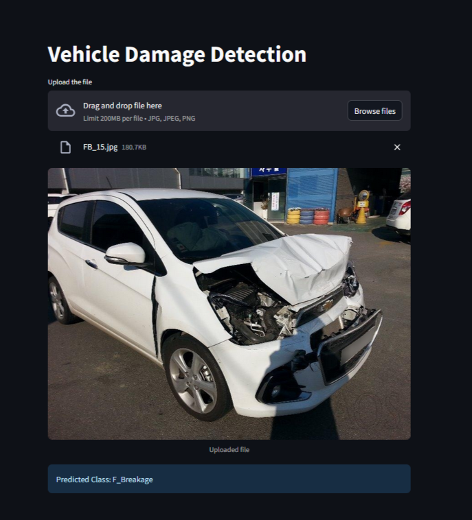

# 🚗 Vehicle Damage Detection App

<div align="center">

[](https://vehicle-damage-detector-ai.streamlit.app/)

 
An interactive web application built with Streamlit and PyTorch that utilizes a fine-tuned ResNet50 deep learning model to classify vehicle damage from uploaded images.

The application uses in-memory stream processing for image handling, ensuring fast predictions and multi-user concurrency without saving temporary files to the disk.

</div>

---

## 📷 Application Preview

  
*Figure 1: Reactive Streamlit UI displaying seamless digital asset upload, in-memory processing, and model classification results.*

---

## ✨ Features

- **Deep Learning Backbone:** Powered by a transfer-learned PyTorch ResNet50 model.
- **Efficient Inference:** Uses Streamlit caching (`@st.cache_resource`) to load the model into memory only once, keeping subsequent predictions near-instantaneous.
- **Concurrent-Safe Processing:** Processes image uploads directly from RAM buffers via `PIL.Image`, making it completely thread-safe for multiple users.
- **Multi-Class Classification:** Automatically classifies images into one of six categories:
  - `F_Breakage` (Front Breakage)
  - `F_Crushed` (Front Crushed)
  - `F_Normal` (Front undamaged)
  - `R_Breakage` (Rear Breakage)
  - `R_Crushed` (Rear Crushed)
  - `R_Normal` (Rear undamaged)

---

## 📂 Project Structure

```text
├── model/
│   └── saved_model.pth     # Trained PyTorch model weights
├── assets/
│   └── demo.png            # Application preview asset graphic
├── app.py                  # Streamlit frontend user interface
├── model_helper.py         # PyTorch inference helper script
├── requirements.txt        # Frozen dependency version matrix
└── README.md               # Project documentation
```

---

## 🚀 Cloud Execution

To view and interact with the production deployment directly without installing any local code dependencies, navigate to our public instances hosting cluster:
👉 **[Launch Live Web Application](https://vehicle-damage-detector-ai.streamlit.app/)**

---

## 💻 Local Installation & Setup

Follow these steps to set up and run the application locally on your machine.

### 1. Set Up a Virtual Environment
Navigate to your project root folder and create a virtual environment to manage dependencies cleanly:

**Windows (Command Prompt):**
```cmd
python -m venv venv
venv\Scripts\activate
```

**macOS / Linux:**
```bash
python3 -m venv venv
source venv/bin/activate
```

### 2. Install Core Dependencies
Ensure your environment has the required packages installed:
```bash
pip install --upgrade pip
pip install -r requirements.txt
```

### 3. Place Your Model Weights
Ensure your trained model file `saved_model.pth` is placed exactly inside the `model/` directory in your root folder:
```text
project-root/model/saved_model.pth
```

### 4. Running the Application
Launch the Streamlit web server using Python's module routing system to bypass regional environment errors:
```bash
python -m streamlit run app.py
```
Once executed, open your local browser to the URL displayed in your terminal:
👉 **`http://localhost:8501`**

---

## 🛠️ Performance Architecture Highlights

### ⚡ Atomic Memory Streaming (Zero-Disk Overhead)
Standard configurations use sloppy disk-writing routines, dumping uploaded files onto local storage. This creates immediate I/O bottlenecks, high security risks, and system crashes under multi-user concurrency. 

This engine eliminates disk-write hazards completely. Uploaded binary streams are processed directly in RAM as **in-memory byte buffers via `PIL.Image` data structures**. This guarantees strict atomic isolation and zero storage leakage under high-concurrency demands.

### 🧠 Strategic Model Virtualization
Reloading deep model weights on every user interaction is an engineering failure that kills server responsiveness. 

Using `@st.cache_resource`, this application hooks the compiled model structure into active memory space on startup. Subsequent inference calls bypass heavy disk-read loops entirely, pulling from global memory space to ensure **near-instant visual predictions**.

### ⚙️ Deterministic Pre-Processing Matrix
Incoming image arrays pass through a standardized transformation pipeline to eliminate domain divergence before hitting the final linear evaluation layer:
- **Geometric Alignment:** Uniform bilinear interpolation forced to exact `(224, 224)` matrix spaces.
- **Tensor Conversion:** Mathematical scaling from standard channel pixels to standardized PyTorch floating-point tensors.
- **Statistical Standardization:** Channel-wise standardization utilizing global ImageNet distribution values to enforce structural consistency:
  - **Mean Vector:** `[0.485, 0.456, 0.406]`
  - **Standard Deviation:** `[0.229, 0.224, 0.225]`
